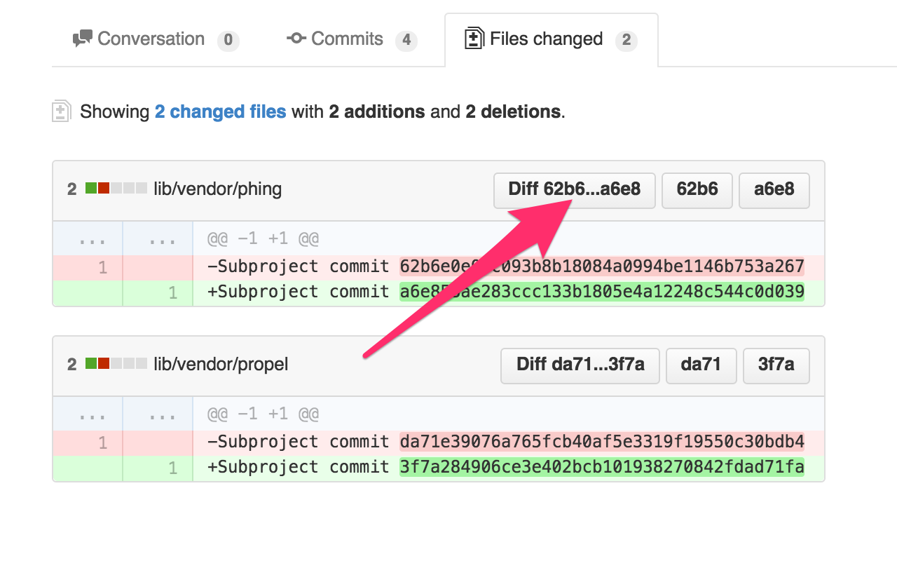

# GitHub submodule links

Adds links for submodule hashes and submodule diffs on GitHub.

------------------------

GitHub doesn't hyperlink to submodules in diffs. To make it easier to track what changed, this extension inserts links to both the referenced submodule commits as well as diffs between them.

## Installation

### Chrome

[Visit the Chrome web store](https://chrome.google.com/webstore/detail/github-submodule-links/ncoknneddcolmgfnmcbemhhaghjdlkkb) and install the extension.

### Firefox
[Get the Firefox add-on](https://addons.mozilla.org/en-US/firefox/addon/github-submodule-links/)

Or to build it yourself,
clone then build with `make` and bundle with cfx/jetpack (too little demand for me to do this for each release). From the firefox build directory:

    ../addon-sdk-1.17/bin/cfx xpi

### Safari

Clone then build with `make` and bundle in Safari (too little demand for me to do this for each release).

## Contributors

Brought to you by [msol](http://msol.io/), aka [@msol](https://twitter.com/msol)

Also thanks to [Allan Mørk Christensen](https://github.com/allanmc) for his significant contributions!
